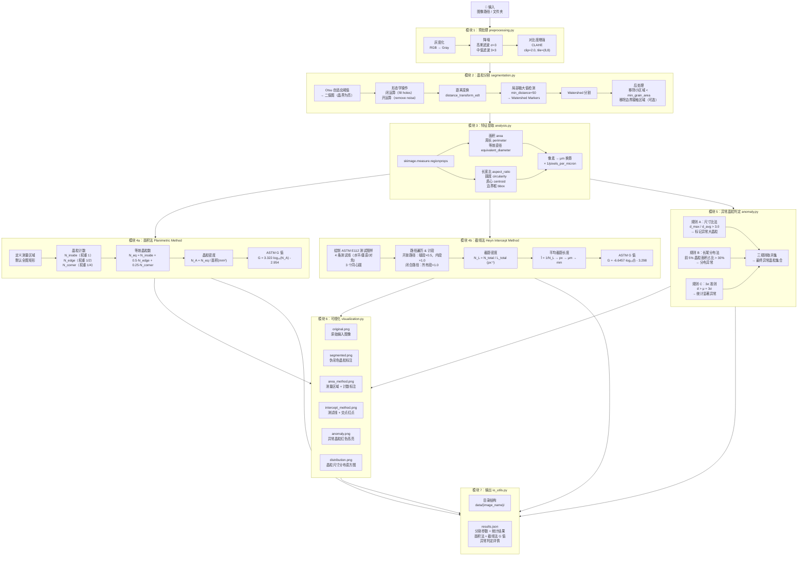
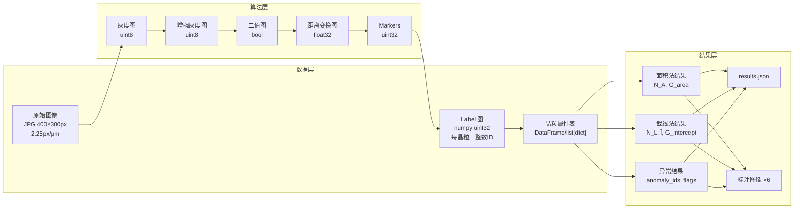
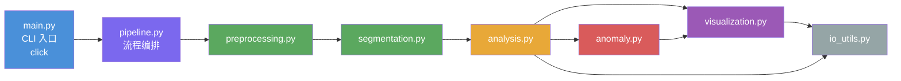
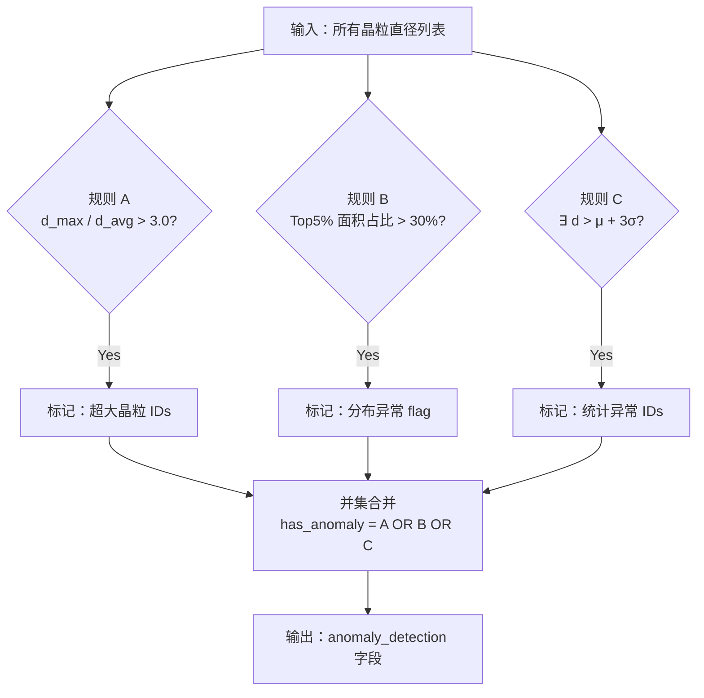

# 晶粒自动化分析系统 — 算法架构图

## 系统总览



---

## 数据流详图



---

## 模块依赖关系



---

## ASTM E112 测试图样（截线法）

```
┌─────────────────────────────────┐
│  ╲                           ╱  │  ← 对角线（左上→右下，右上→左下）
│    ╲        ┌─────┐        ╱    │
│      ╲    ┌─┘     └─┐    ╱      │
│        ╲  │  ┌───┐  │  ╱        │
│          ╲│  │ · │  │╱          │  ← 3 个同心圆（r = 0.7958/0.5305/0.2653）
│          ╱│  │   │  │╲          │
│        ╱  │  └───┘  │  ╲        │
│      ╱    └─┐     ┌─┘    ╲      │
│    ╱        └─────┘        ╲    │
│  ╱                           ╲  │
├─────────────────────────────────┤  ← 水平测试线（底部）
│                                 │
└─────────────────────────────────┘
▲
│  ← 垂直测试线（左侧）
```

---

## 异常判定逻辑


